# Title: Consumer Behavior Analysis - Advertising Project
# Goal: Based on the Consumer behavior data to predict who is more likely to click the ad!
#  Consumer Behavior
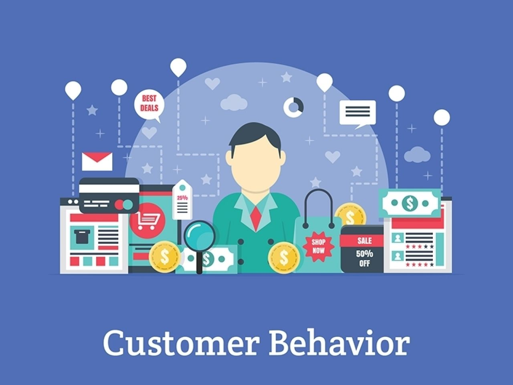
## What is Customer Behavior?
consumer behavior is the study of individuals, groups, or organizations and all the activities associated with the purchase, use, and disposal of goods and services, and how the consumer’s emotions, attitudes, and preferences affect buying behavior. Scource: https://en.wikipedia.org/wiki/Consumer_behaviour

## What affects consumer behavior?
Making decisions are very dynamic processing and a lot of things could affect consumer behavior. Analyzing consumer behavior data are allowed us to present products or services in a way that generates a maximum impact on consumers. Consumer behavior is often influenced by different factors such as:
- Personal factors: a specific characteristic such as age, race, gender, culture, income, personal habit/interest, etc
- Psychological factors: an individual’s response to a marketing message will depend on their perceptions and attitudes.
- Company Website: web design, products’ reviews from other users, recommendation System
- Company‘s physical store service
- Social: Policy, Government, Economy, Competitors, World of mouth, Friends, and Family, etc
- Advertising: Email, Mail, Magazine, Cookie, Social Media, Affiliate(Cashback Website), Partnership (Events like NBA, World Cup, TV Shows)

## Why Consumer Behavior data is important?
Understanding consumer behavior is a vital aspect of marketing. Based on consumer behavior data, we are able to know how consumers make decisions and how potential customers will respond to new products or new services. It is important to explore actionable insights from the data to support companies to put forward corresponding strategies.
For example, if you visit this kind of website, you do not know where should you start with and you will lose your patient then you will want to leave this website immediately. That is why we do the tests (such as AB test, usability test, etc) to gain insights into customer behavior in order to optimize the customer journey and improve key KPIs — Conversion Rate, Revenue, Customer Life Time Value, and AOV (Average Order Value).
A good and nice e-commerce website can greatly affect consumer behavior.
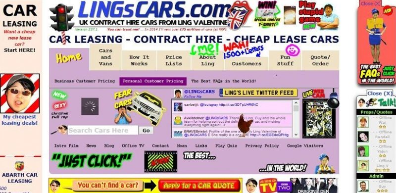
# The Perspective of Behavioral Economics
Behavioral Economics is the study of psychology as it relates to the economic decision-making processes of individuals and institutions. It could be combined with consumer behavior to study how people make decisions and how to affect people to make decisions with ‘invisible hands’.

Dan Ariely is an Israeli-American professor of psychology and behavioral economics at Duke University. He mainly studies the role of human psychological phenomena in economics and how to use human psychological phenomena to influence people’s economic behavior. There are some classical examples to show how to influence consumers’ behavior.

## 1st example: 
When you apply for driver’s license at DMV you can see there is a part in your application to show if you wish to donate your organs and tissues after declared death. Dan Ariely did research about the ratio of the people who are willing to donate their organs in European countries and here is the bar chart for the result.

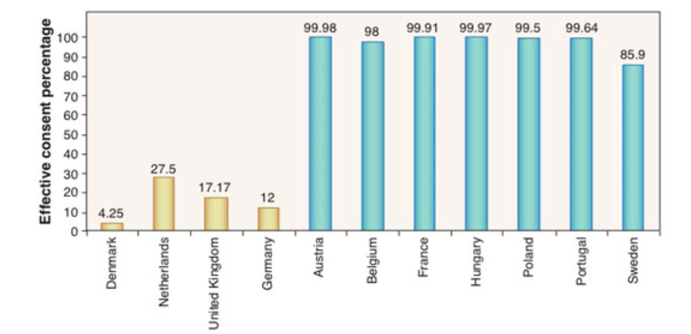

The first four countries' situations are very different from the remaining countries. You might think those differences due to cultural and religious reasons, however, the cultures and religions of some countries are very similar. After research, he finally found that the biggest difference between those countries is the DMV application designs.
- design1 - Countries with low ratio: “If you wish to donate your organs and tissue, please sign here…”
- design2 -Countries with high ratio: “If you do not wish to donate your organs and tissue, please sign here…”

As long as people notice that there is something relative to “organ donation”, by the “default” most people will not sign for design 1 or design 2. So the people’s decision was affected by the different designs of organ donation consent. This is a kind of dependence on the default options because it does not give people psychological pressure.
## 2nd example:
If one brand always offers a “big sale” promotion, most consumers will think that the real price is cheaper than the after-sale price and might also think “low price = low quality”. On the other hand, another expensive brand rarely offers discounts. If there is a big sale of this brand, most consumers are more likely to purchase and maybe buy some products that they might not really need.

## 3rd example:
There is a traveling advertisement which is for a 7-DAY tour for Rome or Paris. People have two equal options — $1800 includes the fees of hotels and meals for both different cities. The number of people who chose Roma is similar to that of people who chose Paris.

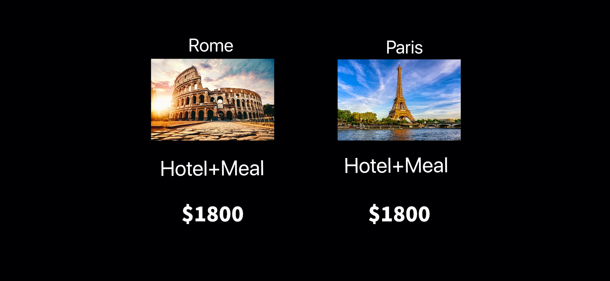

After a new option was added — ‘Rome: Hotel+No Meal — $1800’, most people chose to go to Rome with the “Hotel+Meal”. Actually adding the “Hotel+No Meal” option is meaningless and obviously not a lot of people will choose it. However, the purpose of the new option is to influence people’s decisions.

# Project Introduction
- The dataset created by Jose Portilla and Pierian Data for his Udemy Course (Python for Data Science and Machine Learning Bootcamp). You can get the data from -  https://www.kaggle.com/fayomi/advertising.
- The data contains ten different columns:
    1. Daily Time Spent on a Site -- Time spent by the user on a site in minutes.
    2. Age -- Customer's age in terms of years.
    3. Area Income -- Average income of geographical area of consumer.
    4. Daily Internet Usage -- Avgerage minutes in a day consumer is on the internet.
    5. Ad Topic Line -- Headline of the advertisement.
    6. City -- City of the consumer.
    7. Male -- Whether or not a consumer was male.
    8. Country -- Country of the consumer.
    9. Timestamp -- Time at which user clicked on an Ad or the closed window.
    10. Clicked on Ad -- 0 or 1 is indicated clicking on an Ad or not - 
         Class 0 - not clicked ,and  Class 1 - clicked.
- The goal of this project is to predict what kind of consumers are more likely to click the ad.

# EDA 
## Numertial Data VS Target
 - Based on the image below, we can see that people who spend more time — around 80 minutes on the site are not likely to click the ad, and people who spend around 50 minutes are more likely to click the ad. The average age of the people who clicked the ad is around 40 and the average area income of consumers in class 1 is around 50000. Last, consumers in Class 1 have less daily internet usage. Those subplots are very informative and bring us some basic ideas. Besides numerical data, text data can also bring some useful information. For example, what kind of headline or topic of the ad is more attractive and consumers are more likely to click it.
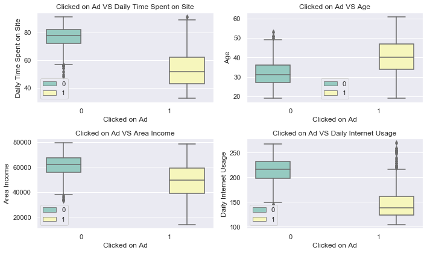

## Text Data
- People prefer topics like team-oriented, fully configurable, and context-sensitive, etc. We also can see that some topics that consumers do not really interest in.
### Bigram
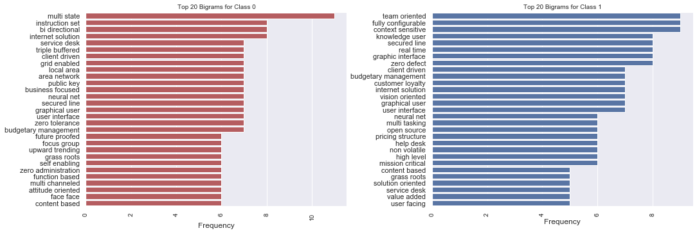
### Word Cloud 

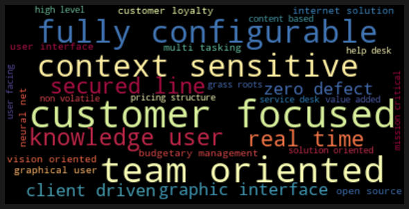

## Correlations
- The average age in class 1 is always higher than that in class 0 in every single hour and weekday.
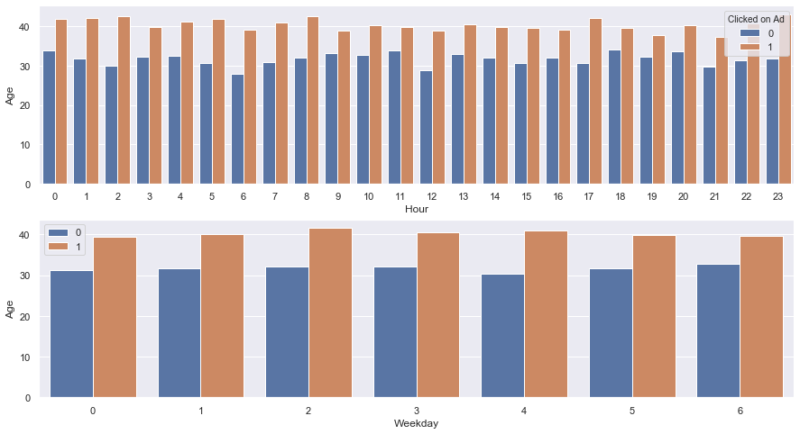
- The images below show that gender are even in two Classes and both female and male consumers who have lower area income are more likely to click the ad.
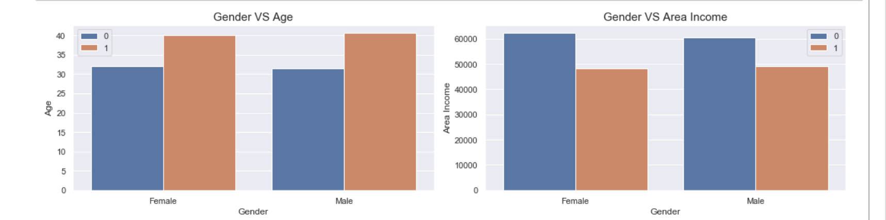
- People aged around 40 who spend less than 80 minutes are more likely to click the ad. In Class 1, the mean age is around 40, and the daily internet usage range is between 100–200.
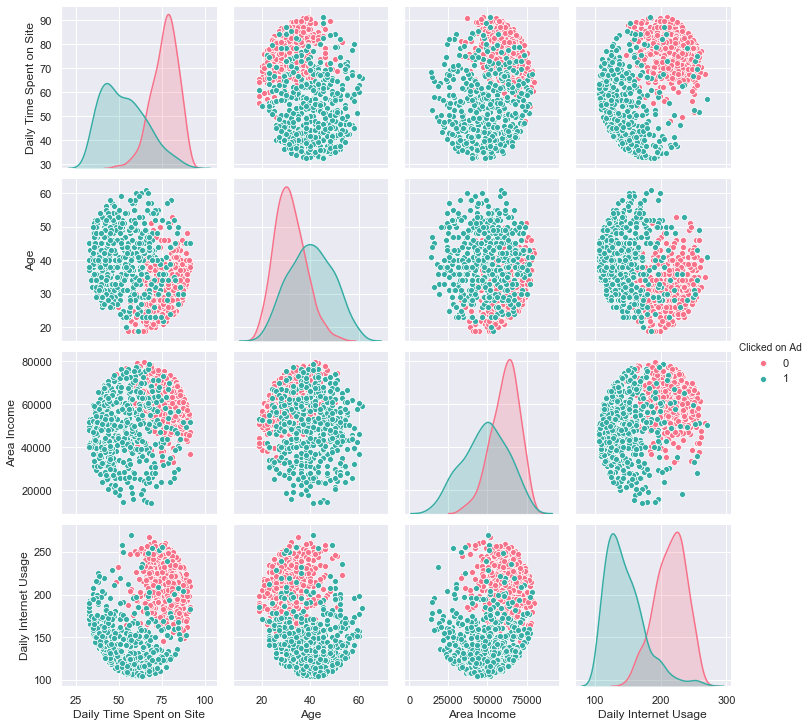
- Code Source :https://www.kaggle.com/konchada/logistic-vs-random-forest-model-for-ad-click

## Modeling 
- Random Forest was applied in this project. After tuned hyperparameters with Grid Search and fitted the model, the accuracy and F1 score are up to 97%.
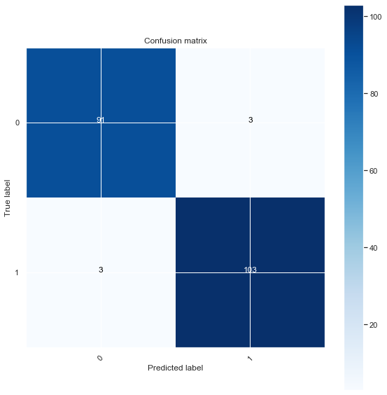
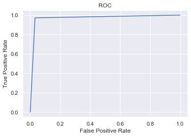

- The feature importance chart shows that daily internet usage, daily time spent on the site, age, and area income play important roles for consumers' decision — “ Click it or not”!
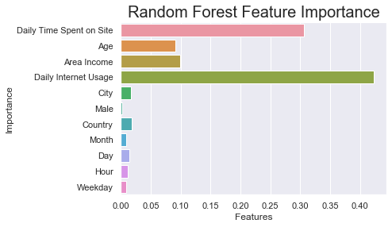

Referece:
- https://www.omniconvert.com/blog/consumer-behavior-in-marketing-patterns-types-segmentation.html
